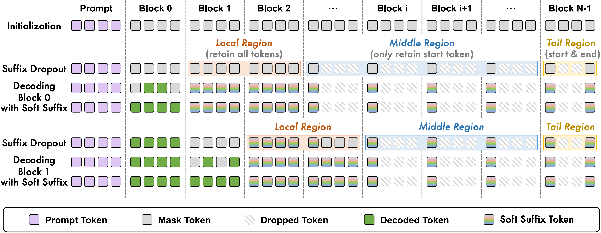

<div align="center">

<p>
  
</p>

<h2>Accelerating Diffusion Language Models via Structured Suffix Modeling</h2>

<p>
  Official implementation of <strong>Structured Suffix Modeling (SSM)</strong>,
  an efficient inference method for block-wise diffusion language models.
</p>

</div>

## 🧩 Design Overview



SSM reduces redundant computation by retaining a dense local suffix, selectively preserving informative tokens from more distant suffix blocks, and reusing their soft states to warm-start subsequent decoding blocks.

## 📣 News

- We will release our paper on arXiv.

## 🌟 Key Features and Modifications

This repository builds on the [DPad](https://github.com/Crys-Chen/DPad) codebase and introduces the following changes for SSM:

- **Expanded sampling support**: Added SSM and streaming-dLLM samplers, implemented soft-suffix modeling in `generate_dropout.py`, and completed the orthogonal dual-cache component.
- **Improved Dream evaluation**: Identified duplicated few-shot content in the MBPP and MATH datasets and fixed a bug that failed to truncate model outputs at stop words when `escape_until=false`. The optional `dream/postprocess_mbpp.py` and `dream/postprocess_math.py` scripts are also provided as fallback post-processing tools.

## 📦 Installation

Clone the repository and create the environment:

```bash
git clone https://github.com/zifengcheng/SSM
cd SSM

conda create -n ssm python=3.10
conda activate ssm
pip install -r requirements.txt
```

Model weights are loaded through Hugging Face. The launchers currently set `HF_ENDPOINT=https://hf-mirror.com`. Edit or remove this environment setting in the corresponding `run.py` file to use the default Hugging Face endpoint.

## 🏃 Quick Start

The launchers use relative paths, so run each command from the corresponding model directory.

```bash
# LLaDA: SSM with suffix soft state
cd llada
python run.py -n "SSM+Par" -t gsm8k -m instruct -s 4 -l 256 -b 32 -th 0.9 -d ssm -lw 64 --use_suffix_soft_state -sk 3 -sa 0.3 -e -re

# Dream: SSM with suffix soft state
cd ../dream
python run.py -n "SSM+Par" -t gsm8k -m base -s 4 -l 256 -b 32 -th 0.9 -d ssm -lw 48 --use_suffix_soft_state -sk 5 -sa 0.2 -e -re

# Dream: Streaming-dLLM (soft state is disabled by default)
python run.py -n "Streaming-dLLM" -t gsm8k -m base -s 4 -l 256 -b 32 -th 0.9 -d streaming_dllm -lw 48 -e -re
```

Both model families support SSM suffix sampling, prefix caching with `-c`, and dual caching with `-dc`. Soft-state mixing is opt-in: add `--use_suffix_soft_state` to enable it. Dream also supports `-d streaming_dllm`, which uses hard token states by default.

## 🎛️ SSM Parameters

| Short option | Long option | Description |
| --- | --- | --- |
| `-lw` | `--local_window` | Number of leading suffix tokens retained densely. |
| `-sk` | `--suffix_soft_topk` | Number of vocabulary candidates used in each soft embedding. |
| `-sa` | `--suffix_soft_alpha` | Mixture coefficient between the mask embedding and the top-k posterior embedding. |

Run `python run.py --help` inside either model directory for the complete set of model-specific options.

## 📊 Evaluation

Evaluation scripts are located in `llada/scripts` and `dream/scripts`. The provided configurations cover:

- GSM8K
- Minerva Math
- HumanEval
- MBPP

Run the included script collections as follows:

```bash
# LLaDA
cd llada
bash scripts/ssm_instruct.sh
bash scripts/ssm_1.5.sh

# Dream
cd ../dream
bash scripts/ssm_base.sh
```

HumanEval execute model-generated code through the evaluation harness. Run code-generation evaluation only in an isolated and trusted environment.

### HumanEval Post-processing

The HumanEval benchmark requires a post-processing step to sanitize generated code and calculate the final `pass@1` score. After evaluation finishes, run:

```bash
python postprocess_code.py path/to/your/samples_humaneval_xxx.jsonl
```

Replace the example path with the generated samples file in the configured `output_path`.

### Dream MATH and MBPP Post-processing

If accuracy is not calculated correctly for MATH or MBPP with Dream, use the fallback scripts in the `dream` directory:

- `dream/postprocess_math.py`
- `dream/postprocess_mbpp.py`

## 🗂️ Outputs

Each launcher derives an experiment name from the task, decoding configuration, and SSM parameters. Results are written under the selected model directory:

```text
output/
├── log/<model>/                 # Standard output and aggregate metrics
├── debug/<model>/               # Standard error and failure traces
├── checkpoint/<model>/          # Per-rank JSONL generations for resume
├── humaneval_results/           # HumanEval artifacts
└── mbpp_results/                # Dream MBPP artifacts, when applicable
```

Use `-re` to overwrite the generation checkpoint for an experiment. Without it, completed samples are loaded from the existing per-rank JSONL file when the evaluation adapter supports resuming.

## 🔁 Reproduction Notes

- `gen_length` must be divisible by `block_size`.
- The total number of diffusion steps must be divisible by the number of generation blocks.
- `-th 0` uses fixed-step decoding; values in `(0, 1)` use confidence-threshold decoding.
- Output paths and evaluation-script paths are relative to `llada/` or `dream/`; launch commands from the correct directory.
- Model loading requires access to the corresponding Hugging Face checkpoints.
- Multi-GPU behavior is managed by Accelerate. For LLaDA, `--single_gpu_id` can pin a run to one physical GPU.

## 🤝 Acknowledgements

This codebase builds on [Fast-dLLM](https://github.com/NVlabs/Fast-dLLM) and [DPad](https://github.com/Crys-Chen/DPad), with foundations provided by the original [LLaDA](https://ml-gsai.github.io/LLaDA-demo/) and [Dream](https://hkunlp.github.io/blog/2025/dream/) models. We thank their authors for making their work publicly available. We are also grateful to the Hugging Face team for the open-source tools that support this research.

## ⚖️ License

Source files in this repository carry Apache License 2.0 headers. See the individual source files and upstream model repositories for applicable notices and third-party terms.

## 📚 Related Citation

This implementation builds on DPad. Please cite the original DPad paper when using its inherited components:

```bibtex

```
